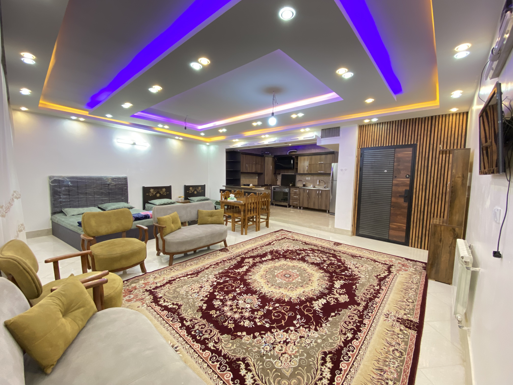

# 💻 README-CODE | راهنمای کدهای پروژه VakilStay

این فایل برای توضیح جزئی‌تر کدهای پروژه و آمادگی برای ارائه و تغییرات احتمالی پروژه تهیه شده است.

---

# 1. نقش هر زبان در پروژه

```text
HTML
↓
ساختار و محتوای سایت

CSS
↓
ظاهر و طراحی سایت

JavaScript
↓
رفتار و تعاملات سایت
```

به زبان ساده:

* **HTML:** چه چیزی روی صفحه باشد؟
* **CSS:** چه شکلی باشد؟
* **JavaScript:** چه کاری انجام دهد؟

---

# 2. HTML

HTML ساختار اصلی صفحه را ایجاد می‌کند.

مثال:

```html
<section class="rooms" id="rooms">

    <div class="room-card">

        

        <h3>واحد ۱</h3>

        <a href="#" class="btn">
            رزرو
        </a>

    </div>

</section>
```

### تگ‌های مهم

`section` → ایجاد یک بخش از صفحه

`div` → ایجاد یک container برای قرار دادن عناصر

`img` → نمایش تصویر

`h1` تا `h6` → عنوان‌ها

`p` → پاراگراف

`a` → لینک

`button` → دکمه

---

# 3. Class و ID

مثلاً:

```html
<div class="room-card" id="room1">
```

`class` برای گروه‌بندی عناصر و اتصال آن‌ها به CSS استفاده می‌شود.

```css
.room-card {
    background: white;
}
```

`id` یک شناسه منحصربه‌فرد برای یک عنصر است و می‌تواند در JavaScript یا لینک‌های داخلی استفاده شود.

```javascript
document.getElementById('room1');
```

---

# 4. تغییر متن

برای تغییر متن کافی است محتوای داخل تگ را تغییر دهیم:

```html
<h3>واحد ۱</h3>
```

مثلاً:

```html
<h3>واحد یک چهار تخته</h3>
```

---

# 5. تغییر عکس

```html

```

`src` مسیر عکس را مشخص می‌کند.

مثلاً:

```html

```

`alt` توضیح متنی تصویر است و برای دسترسی‌پذیری و زمانی که تصویر نمایش داده نمی‌شود کاربرد دارد.

---

# 6. CSS

CSS ظاهر عناصر را مشخص می‌کند.

مثال:

```css
.room-card {
    background: rgba(255, 255, 255, 0.15);
    border-radius: 20px;
    padding: 20px;
    box-shadow: 0 10px 30px rgba(0,0,0,0.15);
}
```

---

# 7. Background

برای تغییر رنگ پس‌زمینه:

```css
body {
    background: #f5f1eb;
}
```

مثلاً:

```css
body {
    background: #ffffff;
}
```

رنگ‌ها می‌توانند به صورت Hex نوشته شوند.

```text
#ffffff → سفید
#000000 → مشکی
```

---

# 8. RGBA

`rgba` برای تعیین رنگ همراه با شفافیت استفاده می‌شود.

```text
R → Red
G → Green
B → Blue
A → Alpha
```

مثال:

```css
background: rgba(255, 255, 255, 0.15);
```

سه عدد اول رنگ را مشخص می‌کنند:

```text
255, 255, 255 → سفید
```

عدد آخر میزان شفافیت است و بین `0` و `1` قرار می‌گیرد:

```text
0   → کاملاً شفاف
0.5 → ۵۰٪ شفاف
1   → کاملاً مات
```

مثلاً:

```css
rgba(255, 255, 255, 0.5)
```

یعنی سفید با ۵۰٪ شفافیت.

---

# 9. Border Radius

برای گرد کردن گوشه‌ها:

```css
border-radius: 20px;
```

عدد بیشتر → گوشه‌های گردتر

مثلاً:

```css
border-radius: 5px;
```

گوشه‌های کمتر گرد هستند.

---

# 10. Box Shadow

برای ایجاد سایه:

```css
box-shadow: 0 10px 30px rgba(0,0,0,0.15);
```

اگر بخواهیم سایه حذف شود:

```css
box-shadow: none;
```

---

# 11. Padding و Margin

`padding` فاصله **داخل عنصر** است:

```css
padding: 20px;
```

`margin` فاصله **خارج عنصر با عناصر اطراف** است:

```css
margin: 20px;
```

به صورت ساده:

```text
       Margin
    ┌─────────────┐
    │   Padding   │
    │  ┌───────┐  │
    │  │Content│  │
    │  └───────┘  │
    └─────────────┘
```

---

# 12. Width و Height

برای تعیین اندازه:

```css
.room-card {
    width: 300px;
    height: 400px;
}
```

`width` → عرض

`height` → ارتفاع

---

# 13. اندازه و ضخامت متن

اندازه متن:

```css
font-size: 30px;
```

ضخامت متن:

```css
font-weight: 700;
```

مثلاً:

```css
h1 {
    font-size: 40px;
    font-weight: bold;
}
```

---

# 14. تغییر ظاهر دکمه

HTML:

```html
<a class="btn">رزرو</a>
```

CSS:

```css
.btn {
    background: #8B6F47;
    color: white;
    padding: 10px 20px;
    border-radius: 10px;
}
```

هر کدام وظیفه خاصی دارند:

```text
background → رنگ پس‌زمینه
color → رنگ متن
padding → فاصله داخلی
border-radius → گردی گوشه‌ها
```

---

# 15. Hover

برای تغییر ظاهر هنگام قرار گرفتن موس روی عنصر:

```css
.btn:hover {
    background: #000000;
}
```

`hover` یعنی زمانی که نشانگر موس روی عنصر قرار می‌گیرد.

---

# 16. Responsive Design

برای تغییر ظاهر سایت در اندازه‌های مختلف صفحه از Media Query استفاده می‌شود:

```css
@media (max-width: 768px) {

    .room-card {
        width: 90%;
    }

}
```

یعنی اگر عرض صفحه حداکثر ۷۶۸ پیکسل باشد، این قوانین اجرا شوند.

بنابراین می‌توان ظاهر سایت را برای موبایل، تبلت و دسکتاپ تنظیم کرد.

---

# 17. Gap

`gap` فاصله بین عناصر داخل Flex یا Grid را مشخص می‌کند.

```css
gap: 20px;
```

مثلاً:

```css
gap: 10px;
```

عناصر به هم نزدیک‌تر می‌شوند.

---

# 18. JavaScript

JavaScript رفتار و تعاملات سایت را کنترل می‌کند.

مثلاً HTML یک دکمه ایجاد می‌کند:

```html
<button id="langToggle">
    English
</button>
```

و JavaScript مشخص می‌کند با کلیک روی آن چه اتفاقی بیفتد.

---

# 19. پیدا کردن عناصر در JavaScript

```javascript
const slider = document.getElementById('roomSlider');
```

یعنی عنصری که `id` آن `roomSlider` است پیدا شده و داخل متغیر `slider` قرار می‌گیرد.

همچنین:

```javascript
slider.querySelector('.room-card');
```

یک عنصر با کلاس `room-card` را داخل Slider پیدا می‌کند.

---

# 20. Event Listener

برای واکنش به اقدامات کاربر:

```javascript
langToggle.addEventListener('click', () => {
    switchLanguage();
});
```

یعنی:

> وقتی کاربر روی `langToggle` کلیک کرد، تابع `switchLanguage` اجرا شود.

`click` → نوع رویداد

`addEventListener()` → گوش دادن و واکنش به رویداد

---

# 21. اسکرول افقی واحدها

یکی از قابلیت‌های JavaScript پروژه، حرکت افقی کارت‌های واحدها است:

```javascript
const card = slider.querySelector('.room-card');

const cardWidth = card.offsetWidth + 24;

slider.scrollBy({
    left: direction === 'next'
        ? cardWidth
        : -cardWidth,
    behavior: 'smooth'
});
```

### خط اول

```javascript
const card = slider.querySelector('.room-card');
```

یک کارت واحد را پیدا می‌کند.

### خط دوم

```javascript
const cardWidth = card.offsetWidth + 24;
```

عرض کارت را محاسبه می‌کند و ۲۴ پیکسل فاصله نیز به آن اضافه می‌کند.

### خط سوم

```javascript
slider.scrollBy(...)
```

مقدار اسکرول Slider را تغییر می‌دهد.

اگر جهت `next` باشد:

```text
+ cardWidth
```

اگر جهت مخالف باشد:

```text
- cardWidth
```

و:

```javascript
behavior: 'smooth'
```

باعث می‌شود حرکت به صورت نرم انجام شود.

---

# 22. تغییر زبان

در HTML متن‌های فارسی و انگلیسی ذخیره می‌شوند:

```html
<h3
    data-fa="واحد ۱"
    data-en="Room 1">
    واحد ۱
</h3>
```

```text
data-fa → متن فارسی
data-en → متن انگلیسی
```

JavaScript بر اساس زبان انتخاب‌شده، متن مناسب را نمایش می‌دهد.

جهت صفحه نیز تغییر می‌کند:

```text
فارسی → RTL
English → LTR
```

---

# 23. راهنمای سریع تغییرات


| درخواست                  | محل تغییر                  |
| ------------------------ | -------------------------- |
| تغییر متن                | `index.html`               |
| تغییر عکس                | `index.html`               |
| تغییر رنگ                | `style.css`                |
| تغییر فونت               | `style.css`                |
| تغییر اندازه             | `style.css`                |
| تغییر فاصله              | `style.css`                |
| تغییر ظاهر دکمه          | `style.css`                |
| تغییر ظاهر موبایل        | `style.css` و `@media`     |
| تغییر رفتار دکمه         | `script.js`                |
| تغییر اسلایدر            | `script.js`                |
| تغییر زبان               | `index.html` + `script.js` |
| اضافه کردن بخش جدید      | `index.html` + `style.css` |
| اضافه کردن قابلیت تعاملی | `script.js`                |

---

# 24. سه قانون مهم برای یادآوری

```text
HTML
چه چیزی روی صفحه باشد؟

CSS
چه شکلی باشد؟

JavaScript
چه کاری انجام دهد؟
```

مثلاً:

**«متن واحد را تغییر بده»**
→ `index.html`

**«رنگ کارت را تغییر بده»**
→ `style.css`

**«با کلیک روی دکمه کاری انجام شود»**
→ `script.js`

**«در موبایل کارت کوچک‌تر شود»**
→ `style.css` → `@media`

**«اسلایدر با دکمه حرکت کند»**
→ `script.js`

این تقسیم‌بندی مهم‌ترین چیزی است که برای پیدا کردن و تغییر کدهای پروژه باید بلد باشم.

