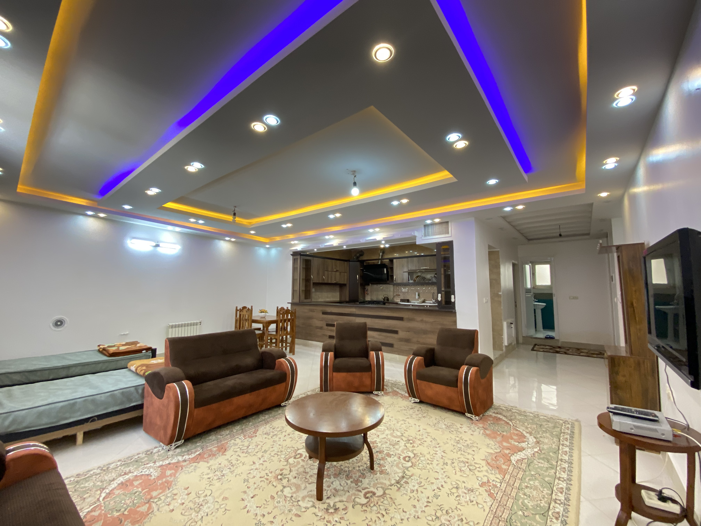

# gust-page
# 🏠 VakilStay | وب‌سایت اقامتگاه وکیل

**پروژه طراحی و پیاده‌سازی یک وب‌سایت معرفی اقامتگاه**

🔗 **مشاهده سایت:**
https://bita-prsp.github.io/gust-page/

🔗 **مخزن پروژه:**
https://github.com/Bita-prsp/gust-page

---

## 1. معرفی پروژه

این پروژه یک وب‌سایت **Front-End** برای معرفی اقامتگاه وکیل در شهر شیراز است.

هدف سایت این است که کاربر بتواند با اقامتگاه، واحدها، امکانات، جاذبه‌های گردشگری و اطلاعات تماس آشنا شود و برای رزرو به صفحه مربوطه در جاجیگا دسترسی داشته باشد.

---

# 2. چرا HTML/CSS/JavaScript و GitHub Pages را انتخاب کردیم؟

دلیل اصلی انتخاب این روش، **رایگان بودن و سادگی آن برای این پروژه** بود.

در ابتدا دانش عمیقی در زمینه کدنویسی نداشتم. به همین دلیل می‌توانستم از WordPress و قالب‌ها و افزونه‌های آماده استفاده کنم؛ اما با کمک **هوش مصنوعی** توانستم کدهای HTML، CSS و JavaScript را ایجاد، اصلاح و یاد بگیرم و بدون نیاز به پرداخت هزینه برای هاست، سایت را پیاده‌سازی کنم.

برای انتشار سایت نیز از **GitHub Pages** استفاده کردم؛ چون پروژه یک سایت Static است و برای آن در حال حاضر نیازی به Back-End یا پایگاه داده نداریم.

در نتیجه روند کلی پروژه این است:

```text
ایده و طراحی
      ↓
کمک گرفتن از AI برای کدنویسی
      ↓
HTML + CSS + JavaScript
      ↓
GitHub
      ↓
GitHub Pages
      ↓
سایت آنلاین و رایگان
```

### چرا WordPress استفاده نشد؟

WordPress ابزار بسیار مناسبی برای سایت‌هایی است که به مدیریت محتوا، قالب و افزونه‌های مختلف نیاز دارند؛ اما برای این پروژه ضروری نبود.

با توجه به اینکه هدف من ساخت یک سایت معرفی ساده و کم‌هزینه بود، ترجیح دادم به جای یادگیری و استفاده از قالب و افزونه‌های WordPress، با کمک AI مستقیماً HTML، CSS و JavaScript را پیاده‌سازی کنم.

بنابراین **AI در این پروژه به عنوان ابزار کمکی برای کدنویسی و یادگیری استفاده شده و GitHub Pages نیز امکان انتشار رایگان سایت را فراهم کرده است.**

---

# 3. اهداف پروژه

اهداف اصلی طراحی این وب‌سایت عبارت‌اند از:

1. معرفی حرفه‌ای اقامتگاه وکیل
2. نمایش واحدهای اقامتی و امکانات آن‌ها
3. فراهم کردن دسترسی سریع به رزرو آنلاین
4. معرفی جاذبه‌های گردشگری شیراز
5. ارائه اطلاعات ضروری برای مسافران
6. طراحی مناسب برای موبایل، تبلت و دسکتاپ
7. ایجاد امکان استفاده از سایت به دو زبان فارسی و انگلیسی
8. پیاده‌سازی عملی مفاهیم Front-End

---

# 4. ساختار کلی پروژه

روند کلی استفاده کاربر از سایت به شکل زیر است:

```text
                     ┌──────────────┐
                     │     کاربر    │
                     └──────┬───────┘
                            ↓
                  ┌──────────────────┐
                  │   صفحه اصلی      │
                  └────────┬─────────┘
                           ↓
       ┌───────────────────┼───────────────────┐
       ↓                   ↓                   ↓
   معرفی اقامتگاه       واحدها            جاذبه‌ها
       │                   │                   │
       │                   ↓                   │
       │              انتخاب واحد             │
       │                   ↓                   │
       │              رزرو در جاجیگا          │
       │                                       │
       └───────────────┬───────────────────────┘
                       ↓
                 اطلاعات تماس
                  و موقعیت
```

---

# 5. تکنولوژی‌های استفاده‌شده

| تکنولوژی         | کاربرد                       |
| ---------------- | ---------------------------- |
| **HTML5**        | ساختار و محتوای صفحه         |
| **CSS3**         | طراحی و ظاهر سایت            |
| **JavaScript**   | ایجاد تعامل و عملکردهای پویا |
| **Bootstrap 5**  | Grid و Responsive Design     |
| **Font Awesome** | آیکون‌ها                     |
| **Vazirmatn**    | فونت فارسی                   |
| **GitHub Pages** | انتشار سایت                  |

---

# 6. ساختار فایل‌های پروژه

```text
gust-page/
│
├── index.html
├── style.css
├── script.js
│
├── Logo.png
├── cover.jpeg
│
├── Pic/
│   ├── shiraz.jpeg
│   ├── 1.jpg
│   ├── 2.jpg
│   ├── 3.jpg
│   └── 4.jpg
│
├── guide.pdf
└── README.md
```

**index.html** → ساختار و محتوای سایت
**style.css** → ظاهر و طراحی سایت
**script.js** → عملکردهای تعاملی
**Pic/** → تصاویر پروژه
**README.md** → مستندات پروژه

---

# 7. ساختار کلی صفحه

```text
┌─────────────────────────────┐
│          Header             │
├─────────────────────────────┤
│           Hero              │
├─────────────────────────────┤
│      معرفی اقامتگاه         │
├─────────────────────────────┤
│       واحدهای اقامتی        │
├─────────────────────────────┤
│     جاذبه‌های گردشگری       │
├─────────────────────────────┤
│      موقعیت و اطلاعات       │
├─────────────────────────────┤
│         تماس با ما          │
├─────────────────────────────┤
│           Footer            │
└─────────────────────────────┘
```

---

# 8. HTML؛ ساختار سایت

HTML وظیفه ایجاد ساختار صفحه را بر عهده دارد.

نمونه‌ای از ساختار کارت واحد:

```html
<section class="rooms" id="rooms">

    <div class="room-card">

        

        <div class="room-info">

            <h3>واحد ۱</h3>

            <ul class="facilities">
                <li>تخت خواب</li>
                <li>آشپزخانه</li>
                <li>تلویزیون</li>
            </ul>

            <a href="#" class="btn">
                رزرو
            </a>

        </div>

    </div>

</section>
```

`section` یک بخش از صفحه را مشخص می‌کند.

`class` برای اتصال HTML به CSS استفاده می‌شود.

`id` یک شناسه برای دسترسی به عنصر ایجاد می‌کند.

`img` برای نمایش تصویر است.

`a` برای ایجاد لینک استفاده می‌شود.

بنابراین HTML وظیفه **ساختاردهی صفحه** را دارد.

---

# 9. CSS؛ طراحی ظاهر

CSS برای کنترل ظاهر عناصر استفاده شده است.

```css
.room-card {
    background: rgba(255, 255, 255, 0.15);
    border-radius: 20px;
    padding: 20px;
    box-shadow: 0 10px 30px rgba(0,0,0,0.15);
}
```

در این کد:

* `background` پس‌زمینه کارت را تعیین می‌کند.
* `border-radius` گوشه‌های کارت را گرد می‌کند.
* `padding` فاصله داخلی را مشخص می‌کند.
* `box-shadow` سایه ایجاد می‌کند.

---

# 10. Responsive Design

برای نمایش مناسب سایت در موبایل، تبلت و دسکتاپ از Bootstrap و Media Query استفاده شده است.

```css
@media (max-width: 768px) {

    .room-card {
        width: 90%;
    }

}
```

این کد می‌گوید در صفحه‌هایی با عرض کمتر یا مساوی 768 پیکسل، قوانین مخصوص موبایل اعمال شود.

---

# 11. JavaScript؛ ایجاد تعامل

JavaScript برای ایجاد رفتارهای پویا در سایت استفاده شده است.

یکی از نمونه‌های مهم پروژه، **اسکرول افقی واحدها** است:

```javascript
const card = slider.querySelector('.room-card');

const cardWidth = card.offsetWidth + 24;

slider.scrollBy({
    left: direction === 'next'
        ? cardWidth
        : -cardWidth,
    behavior: 'smooth'
});
```

ابتدا کارت واحد پیدا می‌شود، سپس عرض آن محاسبه شده و با `scrollBy()` مقدار اسکرول تغییر می‌کند.

اگر کاربر دکمه بعدی را بزند، مقدار مثبت و اگر دکمه قبلی را بزند، مقدار منفی به اسکرول داده می‌شود.

`behavior: 'smooth'` نیز باعث حرکت نرم می‌شود.

---

# 12. تغییر زبان

برای پشتیبانی از دو زبان، متن‌های فارسی و انگلیسی در HTML ذخیره شده‌اند:

```html
<h3
    data-fa="واحد ۱"
    data-en="Room 1">
    واحد ۱
</h3>
```

JavaScript بر اساس زبان انتخاب‌شده، متن مناسب را نمایش می‌دهد.

جهت صفحه نیز بین:

```text
فارسی → RTL
English → LTR
```

تغییر می‌کند.

---

# 13. Event در JavaScript

برای واکنش به اقدامات کاربر از Event Listener استفاده شده است.

```javascript
langToggle.addEventListener('click', () => {
    switchLanguage(
        currentLang === 'fa' ? 'en' : 'fa'
    );
});
```

یعنی وقتی کاربر روی دکمه تغییر زبان کلیک کند، زبان فعلی بررسی شده و زبان به حالت دیگر تغییر می‌کند.

`click` نوع رویداد است و `addEventListener()` برای مدیریت آن استفاده می‌شود.

---

# 14. امکانات اصلی پروژه

* معرفی اقامتگاه وکیل
* معرفی واحدهای اقامتی
* نمایش تصاویر
* نمایش امکانات
* اسکرول افقی واحدها
* لینک رزرو در جاجیگا
* معرفی جاذبه‌های گردشگری شیراز
* لینک مسیریابی
* اطلاعات تماس
* منوی موبایل
* تغییر زبان فارسی و انگلیسی
* طراحی Responsive
* انیمیشن‌های صفحه

---

# 15. چرا پروژه Back-End ندارد؟

این پروژه در حال حاضر یک **Static Front-End Website** است.

هدف فعلی، معرفی اقامتگاه و هدایت کاربر به سیستم رزرو جاجیگا است؛ بنابراین برای نسخه فعلی نیازی به سیستم رزرو، پایگاه داده یا پنل مدیریت اختصاصی وجود ندارد.

در صورت توسعه پروژه، می‌توان امکاناتی مانند:

* ثبت‌نام کاربران
* پایگاه داده
* پنل مدیریت
* رزرو مستقیم
* پرداخت آنلاین
* مدیریت ظرفیت

را به آن اضافه کرد.

---

# 16. انتشار پروژه

پس از آماده شدن فایل‌های پروژه، کدها در GitHub قرار گرفته و با استفاده از GitHub Pages منتشر شده‌اند.

```text
HTML / CSS / JS
       ↓
GitHub Repository
       ↓
GitHub Pages
       ↓
Website
```

**آدرس سایت:**

https://bita-prsp.github.io/gust-page/

---

# 17. جمع‌بندی

در این پروژه یک وب‌سایت واقعی برای معرفی اقامتگاه وکیل طراحی و پیاده‌سازی شد.

در بخش ساختار از **HTML5**، در بخش طراحی از **CSS3 و Bootstrap** و برای تعاملات از **JavaScript** استفاده شد.

به دلیل ماهیت آموزشی و Static بودن پروژه، کدها به صورت مستقیم پیاده‌سازی و با کمک هوش مصنوعی توسعه داده شدند و در نهایت پروژه به صورت رایگان روی **GitHub Pages** منتشر شد.

---

## 👩🏻‍💻 مشخصات پروژه

**نام پروژه:** VakilStay – اقامتگاه وکیل
**نوع پروژه:** Front-End / Static Website
**تکنولوژی‌ها:** HTML5, CSS3, JavaScript, Bootstrap 5
**توسعه‌دهنده:** Bita-prsp

🔗 **Website:**
https://bita-prsp.github.io/gust-page/

🔗 **GitHub:**
https://github.com/Bita-prsp/gust-page
